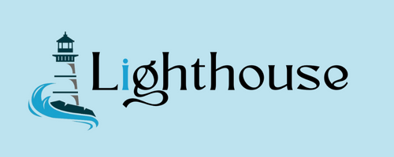

# Lighthouse E-commerce

<div align="center">
  <a href="https://github.com/AnirudhHanda/Lighthouse-fullstack">
    
  </a>
</div>

**Rebuilt with Modern Tech: A Learning Journey**

This project is a recreation of my earlier "Lighthouse" e-commerce website, originally built using vanilla HTML, CSS, and JavaScript. In this revamped version, I've embraced modern web development technologies and practices, focusing on:

* **Frontend:** React with Vite for a fast and efficient development experience. Tailwind CSS for streamlined styling and a beautiful dark theme.
* **Backend:** Spring Boot with Spring Data JPA for a robust and scalable backend API.
* **Database:** PostgreSQL for reliable and efficient data storage
* **Enhanced Features:** Search functionality, responsive design, improved user experience, and more!

**Key Learnings**

* **React Fundamentals:** Component-based architecture, state management, hooks, routing, and API integration.
* **Tailwind CSS:** Utility-first CSS framework for rapid and flexible styling.
* **Spring Boot:** Building RESTful APIs, database integration with JPA, and handling file uploads.
* **PostgreSQL:** Working with a relational database and utilizing its features for data management.
* **Responsive Design:** Creating layouts that adapt seamlessly to different screen sizes.
* **Dark Mode Implementation:** Techniques for creating and managing a visually appealing dark theme.

**Additional Features**

* **Search Functionality:** Real-time search with suggestions and filtered product listings.
* **Admin Dashboard:** Product management (add, edit, delete) with image upload capabilities.
* **Review System:** Allow users to submit reviews and display them on product pages.
* **Pagination:** Efficiently handle large product lists with pagination controls.

## Project Structure

The project is split into two main parts: the backend server and the frontend client.
Below is an overview of the directory and file structure:

**FrontEnd Part**
O16Project/lighthouse-frontend

**Backend Part**
O16Project/LightouseBackend

**Getting Started**

1. **Clone the repository:**
   ```bash
   git clone git@github.com:AnirudhHanda/Lighthhouse-fullstack.git

2. **Install Dependencies (Frontend)**
   ```bash
   cd lighthouse-frontend
   npm install

3. **Set up and run the Backend**
   1. Make sure you have Java and Maven installed
   2. Navigate to the backend project directory
   3. Configure your PostgreSQL database connection in 
     ```bash
        application.properties
      ```
   4. Build and run the backend using Maven:
   ```bash
      mvn spring-boot:run

4. **Start the frontend development server**
   ```bash
   npm run dev


**Future Enhancements**
1. User Authentication and Authorization: Implement user login, registration, and role-based access control.
2. Shopping Cart and Checkout: Add full e-commerce functionality with a shopping cart, checkout process, and order management.
3. Payment Integration: Integrate with a payment gateway to enable secure online payments.
4. Improved Search and Filtering: Enhance search capabilities with advanced filtering and sorting options.

**Contributions**
Contributions are welcome! Feel free to open issues or submit pull requests.